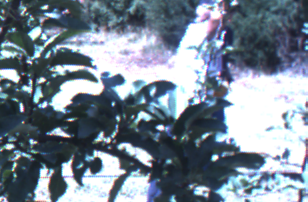
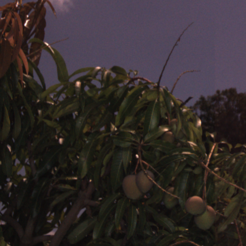
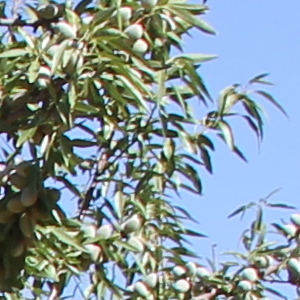

# ACFR Multifruit Dataset 2016

[](https://creativecommons.org/licenses/by-nc/4.0/)
[](https://github.com/ai-agriculture-circuits-and-systems/acfr-multifruit-2016)
[](https://github.com/ai-agriculture-circuits-and-systems/acfr-multifruit-2016)
[](https://github.com/ai-agriculture-circuits-and-systems/acfr-multifruit-2016)
[](https://github.com/ai-agriculture-circuits-and-systems/acfr-multifruit-2016)
[](https://github.com/ai-agriculture-circuits-and-systems/acfr-multifruit-2016/issues)
[](https://github.com/ai-agriculture-circuits-and-systems/acfr-multifruit-2016/pulls)
[](https://github.com/ai-agriculture-circuits-and-systems/acfr-multifruit-2016/graphs/contributors)
[](https://github.com/ai-agriculture-circuits-and-systems/acfr-multifruit-2016/commits)
[](https://doi.org/10.5281/zenodo.xxxxx)

High-quality orchard imagery for fruit detection and instance recognition across apples, mangoes, and almonds. Suitable for object detection, segmentation (apples), and yield-estimation experiments.

- **Project page**: `https://data.acfr.usyd.edu.au/ag/treecrops/2016-multifruit/`
- **Original paper**: `https://arxiv.org/abs/1610.03677`
- **Dataset repository**: `https://github.com/ai-agriculture-circuits-and-systems/acfr-multifruit-2016`

## TL;DR

- **Task**: Detection (+ segmentation for apples)
- **Modality**: RGB
- **Platform**: Ground
- **Real/Synthetic**: Real
- **Images**: 3,704 total (Apples: 1,120; Mangoes: 1,964; Almonds: 620)
- **Resolution**: 308×202 pixels (apples/almonds), 500×500 pixels (mangoes)
- **Annotations**: Per-image CSV (x,y,r or x,y,w,h); apples include per-pixel masks
- **License**: CC BY-NC 4.0 (see License)
- **Citation**: see below

## Table of Contents

- [Download](#download)
- [Dataset Structure](#dataset-structure)
- [Sample Images](#sample-images)
- [Annotation Schema](#annotation-schema)
- [Stats and Splits](#stats-and-splits)
- [Quick Start](#quick-start)
- [Evaluation and Baselines](#evaluation-and-baselines)
- [Datasheet (Data Card)](#datasheet-data-card)
- [Known Issues and Caveats](#known-issues-and-caveats)
- [License](#license)
- [Citation](#citation)
- [Changelog](#changelog)
- [Contact](#contact)

## Download

**Original dataset**: `https://data.acfr.usyd.edu.au/ag/treecrops/2016-multifruit/`

This repo hosts structure and conversion scripts only; place the downloaded folders under this directory.

**Local license file**: See `LICENSE` in the root directory (Creative Commons Attribution-NonCommercial 4.0).

**Alternative sources**: Data hosted by ACFR (Australian Centre for Field Robotics), University of Sydney.

## Dataset Structure

```
acfr-multifruit-2016/
├── almonds/
│   ├── csv/                   # CSV per image
│   ├── json/                  # JSON per image
│   ├── images/                # PNG images
│   ├── labelmap.json          # Label mapping
│   └── sets/                  # train.txt / val.txt / test.txt (plus all.txt, train_val.txt)
├── apples/
│   ├── csv/                   # CSV per image (circles: c-x, c-y, radius)
│   ├── json/                  # JSON per image (optional)
│   ├── images/                # PNG images
│   ├── labelmap.json          # Label mapping
│   ├── segmentations/         # PNG masks (apples only)
│   └── sets/                  # train.txt / val.txt / test.txt (plus all.txt, train_val.txt)
├── mangoes/
│   ├── csv/                   # CSV per image
│   ├── json/                  # JSON per image
│   ├── images/                # PNG images
│   ├── labelmap.json          # Label mapping
│   └── sets/                  # train.txt / val.txt / test.txt (plus all.txt, train_val.txt)
├── annotations/               # COCO JSON output (generated)
│   ├── apples_instances_train.json
│   ├── apples_instances_val.json
│   ├── apples_instances_test.json
│   ├── mangoes_instances_train.json
│   ├── mangoes_instances_val.json
│   ├── mangoes_instances_test.json
│   ├── almonds_instances_train.json
│   ├── almonds_instances_val.json
│   ├── almonds_instances_test.json
│   ├── combined_instances_train.json
│   ├── combined_instances_val.json
│   └── combined_instances_test.json
├── scripts/
│   └── convert_to_coco.py     # Conversion utility
├── LICENSE                     # License file
├── README.md                   # This file
└── requirements.txt            # Python dependencies
```

**Splits**: Splits provided via `{fruit}/sets/*.txt`. List image basenames (no extension). If missing, all images are used.

**Note**: This is a multi-fruit detection dataset. Apples use circular annotations (center and radius) which are converted to bounding boxes for COCO compatibility. Apples also include segmentation masks for pixel-level annotation.

## Sample Images

Below are example images for each fruit category in this dataset. Paths are relative to this README location.

<table>
  <tr>
    <th>Category</th>
    <th>Sample</th>
  </tr>
  <tr>
    <td><strong>Apple</strong></td>
    <td>
      
      <div align="center"><code>apples/images/20130320T004348.182606.Cam6_54.png</code></div>
    </td>
  </tr>
  <tr>
    <td><strong>Mango</strong></td>
    <td>
      
      <div align="center"><code>mangoes/images/20151124T024327.193809_i1590j799.png</code></div>
    </td>
  </tr>
  <tr>
    <td><strong>Almond</strong></td>
    <td>
      
      <div align="center"><code>almonds/images/fromEast_56_04_IMG_4328_i900j3600.png</code></div>
    </td>
  </tr>
</table>

## Annotation Schema

### CSV Format

Each image has a corresponding CSV annotation file in `{fruit}/csv/{image_name}.csv`:

**Apples (circles)**:
```csv
#item,c-x,c-y,radius,label
0,154,101,25,1
1,200,150,30,1
```

- **Coordinates**: `c-x, c-y` - center coordinates of the circle (pixels)
- **Radius**: `radius` - radius of the circle (pixels)
- **Label**: Category ID (1=apple)
- **Conversion**: Circles are converted to COCO bbox format `[c-x - radius, c-y - radius, 2*radius, 2*radius]`

**Mangoes/Almonds (rectangles)**:
```csv
#item,x,y,width,height,label
0,100,200,80,120,1
1,300,150,90,110,1
```

- **Coordinates**: `x, y` - top-left corner of bounding box (pixels)
- **Dimensions**: `width, height` - bounding box dimensions (pixels)
- **Label**: Category ID (1=mango or 1=almond)

**Note**: CSV headers may vary (case-insensitive). The converter handles common variants: `x, y, r, w, h, dx, dy, width, height, c-x, c-y, radius`.

### JSON Format (Per-Image)

Each image also has a corresponding JSON annotation file in `{fruit}/json/{image_name}.json`:

```json
{
  "info": {
    "description": "ACFR Multifruit 2016 Dataset",
    "version": "1.0",
    "year": 2016,
    "contributor": "ACFR, University of Sydney",
    "source": "original",
    "license": {
      "name": "Creative Commons Attribution-NonCommercial 4.0 International",
      "url": "https://creativecommons.org/licenses/by-nc/4.0/"
    }
  },
  "images": [
    {
      "id": 1234567890,
      "width": 308,
      "height": 202,
      "file_name": "20130320T004348.182606.Cam6_54.png",
      "size": 245678,
      "format": "PNG",
      "url": "",
      "hash": "",
      "status": "success"
    }
  ],
  "annotations": [
    {
      "id": 9876543210,
      "image_id": 1234567890,
      "category_id": 1,
      "segmentation": [],
      "area": 15000,
      "bbox": [129, 76, 50, 50]
    }
  ],
  "categories": [
    {
      "id": 1,
      "name": "apple",
      "supercategory": "fruit"
    }
  ]
}
```

### COCO Format

COCO format JSON files are generated in the `annotations/` directory. Example structure:

```json
{
  "info": {
    "year": 2016,
    "version": "1.0.0",
    "description": "ACFR 2016 apples train split",
    "url": "https://data.acfr.usyd.edu.au/ag/treecrops/2016-multifruit/"
  },
  "images": [
    {
      "id": 1,
      "file_name": "apples/images/20130320T004348.182606.Cam6_54.png",
      "width": 308,
      "height": 202
    }
  ],
  "annotations": [
    {
      "id": 1,
      "image_id": 1,
      "category_id": 1,
      "bbox": [129, 76, 50, 50],
      "area": 2500,
      "iscrowd": 0
    }
  ],
  "categories": [
    {"id": 0, "name": "background", "supercategory": "background"},
    {"id": 1, "name": "apple", "supercategory": "fruit"}
  ]
}
```

**Combined mode**: When using `--combined` flag, categories are assigned as: `apple=1`, `mango=2`, `almond=3`.

### Label Maps

Label mapping is defined in `{fruit}/labelmap.json`:

```json
[
  {"object_id": 0, "label_id": 0, "keyboard_shortcut": "0", "object_name": "background"},
  {"object_id": 1, "label_id": 1, "keyboard_shortcut": "1", "object_name": "apple"}
]
```

Each fruit folder includes a `labelmap.json` for original IDs; the provided converter normalizes to a single category per fruit.

### Segmentation Masks (Apples Only)

Apples include per-pixel segmentation masks in `apples/segmentations/{image_name}.png`. These are binary masks where white pixels indicate fruit regions.

## Stats and Splits

### Image Statistics

| Category | Train | Val | Test | Total |
|----------|------|-----|------|-------|
| Apples | - | - | - | 1,120 |
| Mangoes | - | - | - | 1,964 |
| Almonds | - | - | - | 620 |
| **Total** | **-** | **-** | **-** | **3,704** |

### Split Distribution

Splits are provided via `{fruit}/sets/*.txt` files. You may define your own splits by editing those files.

**Note**: Exact train/val/test counts depend on the split files. If split files are missing, all images are used.

### Additional Statistics

- **Geographic coverage**: Australian orchards
- **Collection period**: 2013-2015
- **Sensors**: PointGrey Ladybug3, Prosilica GT3300c, Canon EOS60D
- **Image formats**: PNG (apples/almonds), PNG (mangoes)

## Quick Start

### Load COCO Format Annotations

```python
from pycocotools.coco import COCO
import matplotlib.pyplot as plt

# Load COCO annotation file
coco = COCO('annotations/apples_instances_train.json')

# Get all image IDs
img_ids = coco.getImgIds()
print(f"Total images: {len(img_ids)}")

# Get all category IDs
cat_ids = coco.getCatIds()
print(f"Categories: {[coco.loadCats(cat_id)[0]['name'] for cat_id in cat_ids]}")

# Load a specific image and its annotations
img_id = img_ids[0]
img_info = coco.loadImgs(img_id)[0]
ann_ids = coco.getAnnIds(imgIds=img_id)
anns = coco.loadAnns(ann_ids)

print(f"Image: {img_info['file_name']}")
print(f"Annotations: {len(anns)}")
```

### Convert CSV to COCO Format

```bash
# Convert all fruits to COCO format
python scripts/convert_to_coco.py --root . --out annotations \
    --fruits apples mangoes almonds --splits train val test --combined

# Convert specific fruits
python scripts/convert_to_coco.py --root . --out annotations \
    --fruits apples --splits train val test

# Generate combined files only
python scripts/convert_to_coco.py --root . --out annotations \
    --fruits apples mangoes almonds --splits train val test --combined
```

### Dependencies

**Required**:
- Python 3.6+
- Pillow>=9.5

**Optional** (for COCO API):
- pycocotools>=2.0.7

Install dependencies:
```bash
pip install -r requirements.txt
```

For COCO API example:
```bash
pip install pycocotools
```

## Evaluation and Baselines

### Metrics

- **Detection**: mAP@[.50:.95], mAP@0.50, mAP@0.75
- **Segmentation** (apples): mIoU, Pixel Accuracy
- **Historical comparison**: F1-Score (from original paper)

### Baseline Results

| Model | Metric | Apple | Mango | Almond | Reference |
|-------|--------|-------|-------|--------|-----------|
| Original Paper | F1-Score | 0.904 | 0.908 | 0.775 | [Bargoti & Underwood, 2016] |

**Note**: Modern detection metrics (mAP) should be reported for comparison with current state-of-the-art methods.

## Datasheet (Data Card)

### Motivation

This dataset was created to support research in fruit detection and yield estimation in orchards. The dataset enables the development and evaluation of computer vision models for agricultural applications, specifically for automated fruit counting and harvesting systems.

### Composition

- **Image Types**: RGB images of orchard scenes containing fruits (apples, mangoes, almonds)
- **Categories**: 3 fruit types (apples, mangoes, almonds)
- **Image Format**: PNG
- **Image Size**: 308×202 pixels (apples/almonds), 500×500 pixels (mangoes)
- **Annotation Format**: CSV (per-image), JSON (per-image), COCO JSON (generated)
- **Segmentation**: Per-pixel masks available for apples only
- **Geographic Coverage**: Australian orchards

### Collection Process

Images were collected from Australian orchards using multiple sensor platforms:
- **PointGrey Ladybug3**: Multi-camera system
- **Prosilica GT3300c**: Industrial camera
- **Canon EOS60D**: DSLR camera

Data collection period: 2013-2015.

### Preprocessing

- Images are provided in their original resolutions
- Annotations were created with bounding boxes (circles for apples, rectangles for mangoes/almonds)
- Apple annotations include per-pixel segmentation masks
- Dataset structure standardized for easy integration with detection frameworks
- COCO format conversion scripts provided for compatibility

### Distribution

The dataset is distributed under Creative Commons Attribution-NonCommercial 4.0 license. See `LICENSE` file for details.

### Maintenance

This repository maintains the standardized structure and conversion scripts. Original data sources should be referenced appropriately. Community contributions are welcome via issue tracker.

## Known Issues and Caveats

1. **Image Resolution**: Images have different resolutions: 308×202 pixels (apples/almonds) and 500×500 pixels (mangoes). Original resolutions are preserved.

2. **Annotation Format**: 
   - Apples use circular annotations (center and radius) which are converted to bounding boxes for COCO compatibility
   - Bounding boxes are provided in COCO format `[x, y, width, height]` where `(x, y)` is the top-left corner
   - CSV headers may vary; the converter handles common variants but may need updates for edge cases

3. **File Naming**: Image extensions are `.png` for all fruits. The converter handles both `.png` and `.jpg` extensions.

4. **Segmentation Masks**: Apple masks exist only for apples; other fruits have bounding boxes only.

5. **Dataset Imbalance**: Dataset contains different numbers of images per fruit category (apples: 1,120; mangoes: 1,964; almonds: 620).

6. **Split Distribution**: Splits are provided via `{fruit}/sets/*.txt` files. If missing, all images are used.

7. **Data Source**: Data hosted by ACFR; this repo provides ancillary scripts and standardized structure.

8. **Coordinates**: Coordinates are in pixel units with origin at the image top-left. Ensure downstream tooling expects absolute COCO boxes.

## License

This dataset is licensed under the **Creative Commons Attribution-NonCommercial 4.0 International** license.

Check the original dataset terms and cite appropriately.

See `LICENSE` file for full license text.

## Citation

If you use this dataset in your research, please cite:

```bibtex
@article{bargoti2016deep,
  title={Deep Fruit Detection in Orchards},
  author={Bargoti, Suchet and Underwood, James},
  journal={arXiv preprint arXiv:1610.03677},
  year={2016}
}
```

**Paper Citation**:

```bibtex
@article{Bargoti2016,
  title={Image Segmentation for Fruit Detection and Yield Estimation in Apple Orchards},
  author={Bargoti, Suchet and Underwood, James},
  journal={Journal of Field Robotics},
  year={2016}
}
```

## Changelog

- **V1.0.0** (2025-01-XX): Initial standardized structure and COCO conversion utility

## Contact

**Maintainers**: 
- Open to contributions via issue tracker

**Original Authors**: 
- Suchet Bargoti
- James Underwood
- Australian Centre for Field Robotics (ACFR), University of Sydney

**Source**: 
- Dataset: `https://data.acfr.usyd.edu.au/ag/treecrops/2016-multifruit/`
- Project page: `https://data.acfr.usyd.edu.au/ag/treecrops/2016-multifruit/`
- Paper: `https://arxiv.org/abs/1610.03677`
- Repository: `https://github.com/ai-agriculture-circuits-and-systems/acfr-multifruit-2016`

**Issues**: Please report issues via [GitHub Issues](https://github.com/ai-agriculture-circuits-and-systems/acfr-multifruit-2016/issues) or contact the maintainers.
